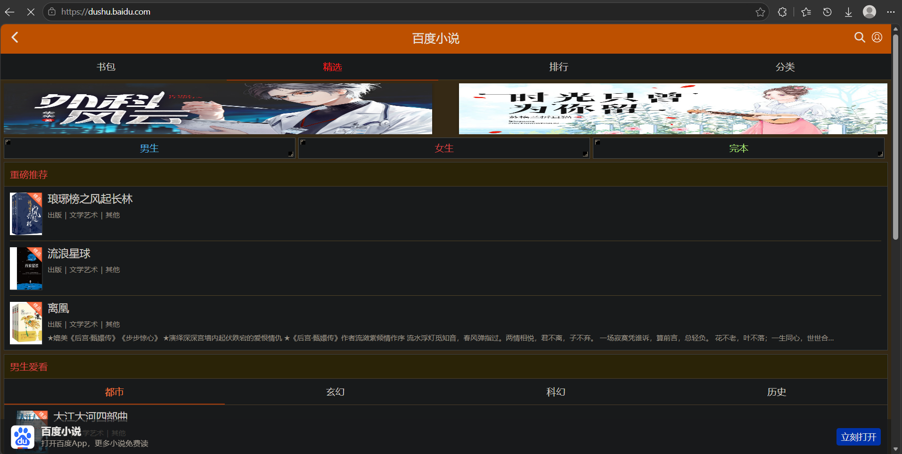
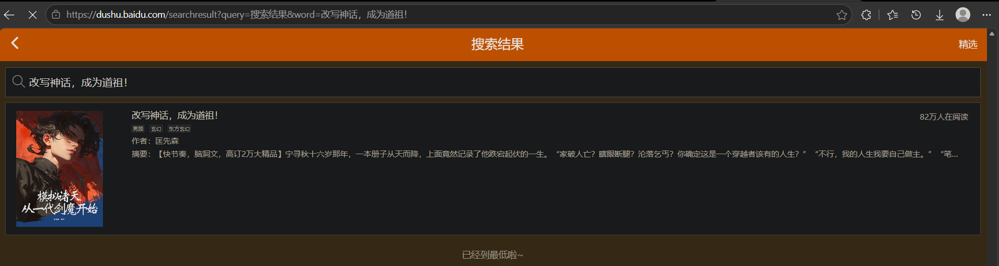
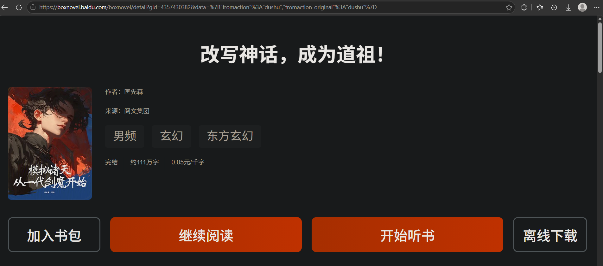
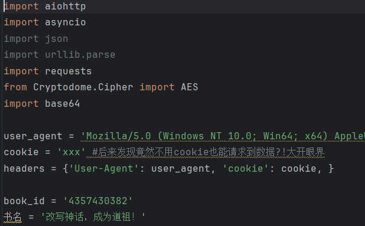

# baidu-novel-spider
异步爬虫抓取百度小说章节内容，能在有权限的情况下爬取全部章节，基于 aiohttp 并发请求，支持批量章节抓取，自带异常字段兜底容错。
因为起点完本小说有不少能在百度小说上看，故呕心沥血做了这个项目
-----------------------------------------
注意！baidu_novol.py相对稳定，用于爬取免费的小说，而novel_spider.py用于爬取全部小说
-----------------------------------------

使用说明
该项目用于抓取百度小说，我尽量让0代码基础的人都能看懂怎么用（或者在ai帮助下学会怎么用）
首先打开百度小说网页版https://dushu.baidu.com/

搜索你想爬取的小说，但是由于百度小说网页版是个烂尾工程，搜索不可以正常用，按我的步骤来

比如想搜索小说《改写神话，成为道祖！》
直接地址栏输入url：https://dushu.baidu.com/searchresult?query=搜索结果&word=改写神话，成为道祖！

把"word=改写神话，成为道祖！"换成"word=xxx"即可，xxx是你想搜索的关键词

如图：

点进去，获取gid，比如地址栏会有https://boxnovel.baidu.com/boxnovel/detail?gid=4357430382&data=%7B"fromaction"%3A"dushu","fromaction_original"%3A"dushu"%7D这样的url，我们只需要获取“gid=4357430382”就好了

然后修改代码文件baidu_novol.py对应的参数，就能使用了，只需要修改book_id和书名两个变量，book_id修改为你之前获得的gid，即4357430382，书名就是小说名。

如图

然后运行即可
需要有python环境，并执行命令
pip install -r requirements.txt
python baidu_novol.py

